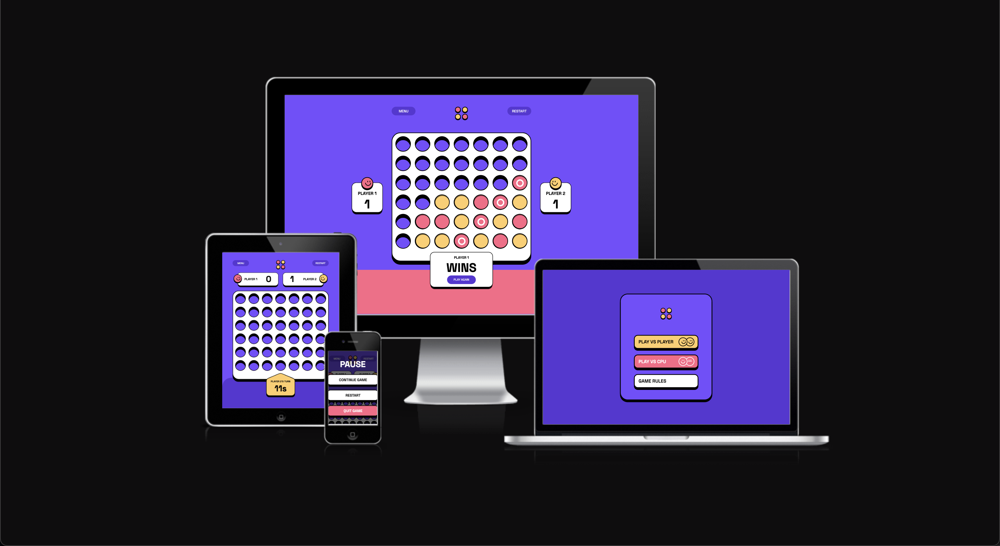

# Frontend Mentor - Connect Four game solution

This is a solution to the [Connect Four game challenge on Frontend Mentor](https://www.frontendmentor.io/challenges/connect-four-game-6G8QVH923s). 

## Table of contents

- [Overview](#overview)
  - [The challenge](#the-challenge)
  - [Screenshot](#screenshot)
  - [Links](#links)
- [My process](#my-process)
  - [Built with](#built-with)
  - [What I learned](#what-i-learned)
  - [Continued development](#continued-development)


## Overview

### The challenge

Users should be able to:

- View the game rules
- Play a game of Connect Four against another human player (alternating turns on the same computer)
- View the optimal layout for the interface depending on their device's screen size
- See hover and focus states for all interactive elements on the page
- **Bonus**: See the discs animate into their position when a move is made
- **Bonus**: Play against the computer

### Screenshot



### Links

- Live Site URL: [Visit the website here](https://olivercadman.github.io/connect_four/)
- Solution URL: [Check out the source code](https://github.com/OliverCadman/connect_four)

## My process

### Built with

- [React](https://reactjs.org/)
- TypeScript
- SASS
- CSS Grid
- Mobile-first workflow
- [React](https://reactjs.org/) - JS library
- [Next.js](https://nextjs.org/) - React framework
- [Styled Components](https://styled-components.com/) - For styles

### What I learned

The most significant learning experience I encountered in this project came through figuring out how to 
provide the ability for a user to play against the computer. After trying my own bespoke solution, a colleague of mine put me onto the minimax algorithm; a recursive algorithm commonly used in 2-player games, in which the CPU essentially makes a scan of possible moves and ways that the game can play out, and decides which is the best move to make based on the predicted outcomes. 

I opted for this algorithm, using alpha-beta pruning to slim down the number of iterations the CPU will make when deciding the optimal move.

For those interested, here is the code:

```js
import { Board } from "../models/Board";
import { Counter } from "../models/Counter";

const ROW_COUNT = 6;
const COLUMN_COUNT = 7;
const WINDOW_LENGTH = 4;

const BOT_PIECE = 0;
const PLAYER_PIECE = 1;

const getValidLocations = (board: (number | null)[][]) => {
  const validLocations: number[] = [];

  for (let i = 0; i < ROW_COUNT; i++) {
    for (let j = 0; j < COLUMN_COUNT; j++) {
      if (board[i][j] === null && !validLocations.includes(j)) {
        validLocations.push(j);
      }
    }
  }
  return validLocations;
};

const convertBoard = (board: (Counter | null)[][]): (number | null)[][] => {
  const convertedBoard: (number | null)[][] = Array.from(
    { length: ROW_COUNT },
    () => new Array(COLUMN_COUNT).fill(null)
  );

  for (let i = 0; i < ROW_COUNT; i++) {
    for (let j = 0; j < COLUMN_COUNT; j++) {
      if (board && board[i][j] !== null && typeof board[i][j] === "object") {
        if (board[i][j]?.player.playerName === "CPU") {
          convertedBoard[i][j] = BOT_PIECE;
        } else {
          convertedBoard[i][j] = PLAYER_PIECE;
        }
      }
    }
  }

  return convertedBoard;
};

const getNextOpenRow = (board: (number | null)[][], column: number) => {
  for (let i = ROW_COUNT - 1; i >= 0; i--) {
    if (board[i][column] === null) {
      return i;
    }
  }
};

const dropPiece = (
  board: number[][],
  row: number | undefined,
  col: number | undefined,
  piece: number
) => {
  if (row && col) board[row][col] = piece;

  return board;
};

const scorePosition = (board: (number | null)[][], piece: number) => {
  let score = 0;

  let centreArr = Array.from(
    board.map((row: (number | null)[]) => row[Math.floor(COLUMN_COUNT / 2)])
  );

  const centreCount = centreArr.filter((i) => i === BOT_PIECE).length;

  score += centreCount * 3;

  // Horizontal
  for (let i = 0; i < ROW_COUNT; i++) {
    const rowArray = Array.from(board[i]);

    for (let j = 0; j < COLUMN_COUNT - 3; j++) {
      const window = rowArray.slice(j, j + WINDOW_LENGTH);
      score += evaluateWindow(window, piece);
    }
  }

  // Vertical
  for (let i = 0; i < COLUMN_COUNT; i++) {
    const colArray = Array.from(board.map((row) => row[i]));

    for (let j = 0; j < ROW_COUNT - 3; j++) {
      const window = colArray.slice(j, j + WINDOW_LENGTH);
      score += evaluateWindow(window, piece);
    }
  }

  // Positive Diagonal
  for (let i = 0; i < ROW_COUNT - 3; i++) {
    for (let j = 0; j < COLUMN_COUNT - 3; j++) {
      const window = Array.from(
        { length: WINDOW_LENGTH },
        (_, index) => board[i + index][j + index]
      );

      score += evaluateWindow(window, piece);
    }
  }

  // Negative Diagonal
  for (let i = 0; i < ROW_COUNT - 3; i++) {
    for (let j = 0; j < COLUMN_COUNT - 3; j++) {
      const window = Array.from(
        { length: WINDOW_LENGTH },
        (_, index) => board[i + 3 - index][j + index]
      );
      score += evaluateWindow(window, piece);
    }
  }

  return score;
};

const evaluateWindow = (window: (number | unknown)[], piece: number) => {
  let score = 0;

  let opponentPiece = PLAYER_PIECE;
  if (piece === PLAYER_PIECE) {
    opponentPiece = BOT_PIECE;
  }

  if (window.filter((i) => piece === i).length === 4) {
    score += 50;
  } else if (
    window.filter((i) => i === piece).length === 3 &&
    window.filter((i) => i === null).length === 1
  ) {
    score += 5;
  } else if (
    window.filter((i) => i === piece).length === 2 &&
    window.filter((i) => i === null).length === 2
  ) {
    score += 2;
  }

  if (
    window.filter((i) => i === opponentPiece).length === 3 &&
    window.filter((i) => i === null).length === 1
  ) {
    score -= 1;
  }

  return score;
};

const isWinningMove = (board: (number | null)[][], piece: number) => {
  // Check vertical
  for (let i = 0; i < 3; i++) {
    for (let j = 0; j < 7; j++) {
      if (
        board[i][j] === piece &&
        board[i + 1][j] === piece &&
        board[i + 2][j] === piece &&
        board[i + 3][j] === piece
      ) {
        return true;
      }
    }
  }

  // Check horizontal
  for (let i = 0; i < 6; i++) {
    for (let j = 0; j < 4; j++) {
      if (
        board[i][j] === piece &&
        board[i][j + 1] === piece &&
        board[i][j + 2] === piece &&
        board[i][j + 3] === piece
      ) {
        return true;
      }
    }
  }

  // Check positive diagonal
  for (let i = 0; i < 3; i++) {
    for (let j = 0; j < 4; j++) {
      if (
        board[i][j] === piece &&
        board[i + 1][j + 1] === piece &&
        board[i + 2][j + 2] === piece &&
        board[i + 3][j + 3] === piece
      ) {
        return true;
      }
    }
  }

  // Check negative diagonal
  for (let i = 3; i < 6; i++) {
    for (let j = 0; j < 4; j++) {
      if (
        board[i][j] === piece &&
        board[i - 1][j + 1] === piece &&
        board[i - 2][j + 2] === piece &&
        board[i - 3][j + 3] === piece
      ) {
        return true;
      }
    }
  }
};

const isTerminalNode = (board: (number | null)[][]) =>
  isWinningMove(board, PLAYER_PIECE) ||
  isWinningMove(board, BOT_PIECE) ||
  getValidLocations(board).length === 0;

export const convertBoardAndCallMiniMax = (board?: Board["board"]) => {
  const convertedBoard = convertBoard(JSON.parse(JSON.stringify(board)));
  const [col, value] = miniMax(convertedBoard, 1, -9999999, 9999999, false);

  return [col, value];
};

const miniMax = (
  board: (number | null)[][],
  depth: number,
  alpha: number,
  beta: number,
  maximisingPlayer: boolean
) => {
  const validLocations = getValidLocations(board);
  const isTerminal = isTerminalNode(board);
  if (depth === 0 || isTerminal) {
    if (isTerminal) {
      if (isWinningMove(board, BOT_PIECE)) {
        return [null, 9999999];
      } else if (isWinningMove(board, PLAYER_PIECE)) {
        return [null, -9999999];
      } else {
        return [null, 0];
      }
    } else {
      return [null, scorePosition(board, BOT_PIECE)];
    }
  }
  if (maximisingPlayer) {
    let value: number = -99999;

    const randomLocationIndex = Math.floor(
      Math.random() * validLocations.length
    );
    let column = validLocations[randomLocationIndex];

    for (let col of validLocations) {
      let row = getNextOpenRow(board, col);

      const boardCopy = JSON.parse(JSON.stringify(board));
      dropPiece(boardCopy, row, col, BOT_PIECE);
      const newScore = miniMax(boardCopy, depth - 1, alpha, beta, false);

      if (newScore && newScore[1] && newScore[1] > value) {
        value = newScore[1];
        column = col;
      }

      alpha = Math.max(alpha, value);
      if (alpha >= beta) break;
    }

    return [column, value];
  } else {
    let value: number = 99999;

    const randomLocationIndex = Math.floor(
      Math.random() * validLocations.length
    );
    let column = validLocations[randomLocationIndex];

    for (let col of validLocations) {
      let row = getNextOpenRow(board, col);

      const boardCopy = JSON.parse(JSON.stringify(board));

      dropPiece(boardCopy, row, col, PLAYER_PIECE);
      const newScore = miniMax(boardCopy, depth - 1, alpha, beta, true);

      if (newScore && newScore[1] && newScore[1] < value) {
        value = newScore[1];
        column = col;
      }

      beta = Math.min(beta, value);
      if (alpha >= beta) break;
    }

    return [column, value];
  }
};
```

### Continued development

- Right now, the CPU difficulty cannot be changed, though changing the difficulty is fairly simple (in theory). Because the minimax algorithm takes the recursive depth as an argument (which translates to the amount of turns that occur in the future), the user can adjust this. Basically, the lower the depth, the worse a player the CPU is.

- It would also be good to set up a WebSocket protocol for this so we can play with our friends across world 

